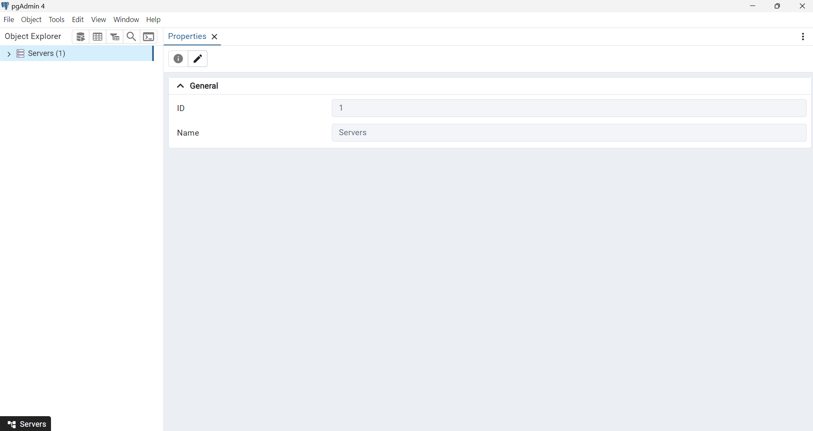
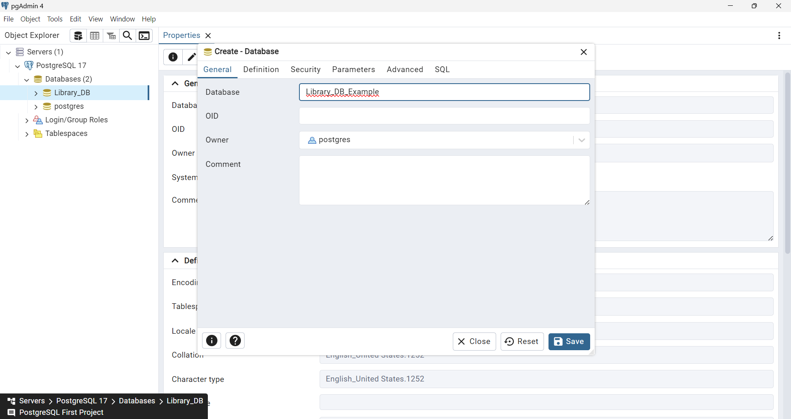

# Library DB - PostgreSQL Project

## Description
Library-DB is a PostgreSQL-based database project designed to manage a library system. The project includes comprehensive tables and queries for handling books, authors, borrowers, and loans. Key features include tracking book loans, managing borrower information, and identifying overdue or currently loaned books.

## Features
- **Authors Management**: Store details about authors, including their name and biography.
- **Books Management**: Track book titles, their authors, publishers, and publication dates.
- **Borrower Management**: Maintain a list of library borrowers with their names and contact details.
- **Loan Management**: Record book loans, including loan and return dates.
Cascade Deletion: Automatically delete associated records (e.g., loans) when an author or book is removed.
- **Query Examples**:
    - List all books by a specific author.
    - Find borrowers of a specific book.
    - Identify overdue loans.
    - Track all books currently on loan.

## Table of Contents
- [Features](#features)
- [Setup and Installation](#setup-and-installation)
- [Usage](#usage)
- [Technologies Used](#technologies-used)
- [Screenshots](#screenshots)
- [Future Improvements](#future-improvements)
- [Contact Information](#contact-information)

## Setup and Installation
Follow these steps to set up the database:

1. Clone the repository:
    git clone https://github.com/OrBenNaim/Army-Training-Program/PostgreSQL-Projects.git

2. Navigate to the project directory:
    cd Library-DB

3. Launch pgAdmin or your preferred PostgreSQL tool.

4. Follow the next steps to creating a new DB:

5. ### Click on the arrow next to 'Servers'

6. ### Right click on 'Databases' and then  click on 'Create' and then click on 'Database...'

7. ### Choose a name for your database and click on 'save'

Go to the src folder and Run the file createTables.sql for creating the necessary  tables

Run the file insertData.sql